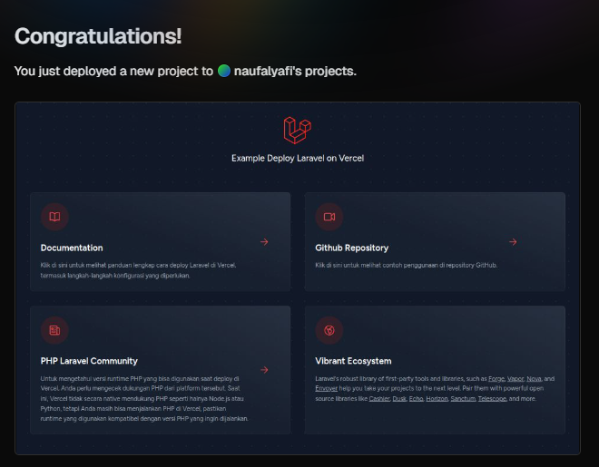
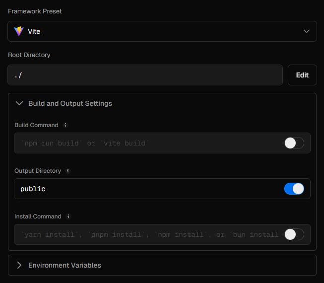

# Deploy Laravel ke Vercel



Vercel memiliki beberapa runtime yang dibagi menjadi 2 yaitu [official runtime](https://vercel.com/docs/functions/runtimes#official-runtimes) dan [community runtime](https://vercel.com/docs/functions/runtimes#community-runtimes).

Baca versi runtime PHP yang didukung bisa baca di [https://github.com/vercel-community/php](https://github.com/vercel-community/php).

## Persiapan

```
├── api
│   └── index.php
├── .vercelignore
├── vercel.json
└── ...
```

## Konfigurasi

Setelah import project, konfigurasi untuk output dir jadi `public` dan masukkan env variable yang kamu gunakan. `APP_KEY` wajib.

